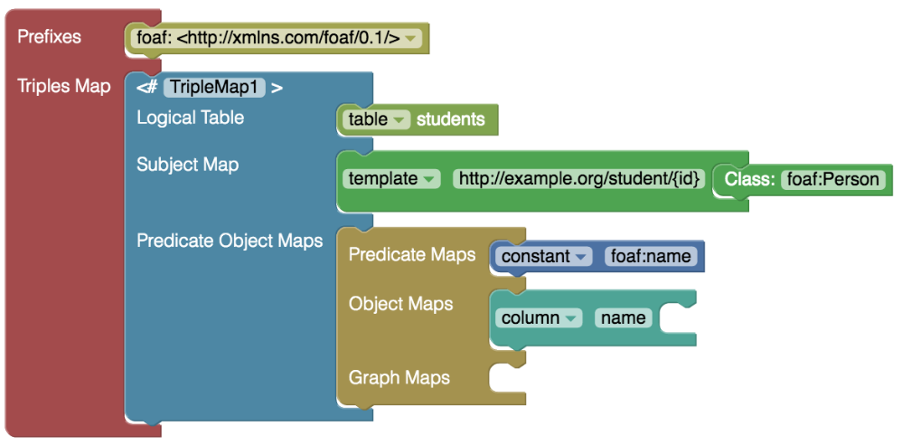
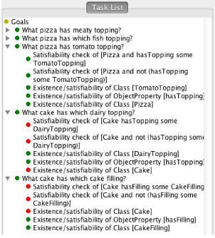
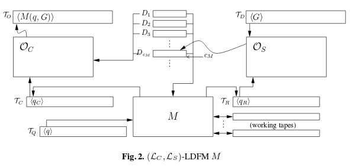

<script src="assets/reveal.js"></script>

<!-- slide -->
# [ISWC2017](https://iswc2017.semanticweb.org/program/)
[Keynotes](#keynotes)
[Workshops and Tutorials](#wt)
[Informal](#informal)
[Sessions](#sessions)
[Video Lectures Online](http://videolectures.net/iswc2017_vienna/)

<!-- slide id="keynotes" -->
# Keynotes
[Deborah L. McGuinness](#knd)
[Nada Lavrač](#knn)
[Jamie Taylor](#knj)

<!-- slide id="knd" -->
## Ontologies for the Modern Age
*"It takes a village."* **Deborah L. McGuinness**

**Collaboration between the specialists is required to complete a successful project.**
Impact requires buy in from diverse fields.
<!-- slide data-notes="Shift from KE writing ontologies whilst consulting DE to KE creating tools that allow DE to accomplish a larger portion of the OA process. Both diagrams show ontologies at the core of the ecosystem, but requiring interaction with other domains to be effective and useful systems." -->
- Domain experts becoming more involved.
- Knowledge Engineers creating more tools than ontologies.


<!-- slide id="knn" -->
## Relational *and* Semantic Data Mining
**Nada Lavrač**

**From data mining to knowledge mining the web, the aim is to be fast *and* informative.**
<small>(Includes background knowledge)</small>
- Choosing data: Estimating relevance, filtering by page rank.
- Methods: 1-to-many data mining, data flattening, data fusion, wordification.
- Implemented and shared with [ClowdFlows](http://clowdflows.org/)

<!-- slide id="knj" -->
## Applied Semantic: Beyond the catalog
**Jamie Taylor**
Encoding the real world:
- History
  - Relational Database wasn't good enough, therefore ontologies (Knowledge Graphs).
  - Consider DBpedia, Freebase etc. as preliminary exploration.
  - "Knowledge Graph" not ~~"oncology"~~ "ontology" (Capsenta)

<!-- slide -->
- Challenges
  - Managing identity is hard
  - Ontology quality is important and difficult
  - Semantic Modelling is hard
  - 15% Google searches/day are new
  - "A little semantics goes a long way" **?** (Hendler)

<!-- slide -->
- Future
  - What is the ROI for semantics? *"A little semantics goes a long way."* J. Hendler
  - Need to encode ~~common~~ important sense, the kind of things that aren't noted:
    - Polio Vaccine: prevents Polio
    - Oven: heat
    - Chair: sit
    - Plane: fly
    - {Concept: verb}
  *(NLP from dictionaries as a starting point)*

<!-- slide -->
  - Result
    - Purpose of objects encoded (important sense).
    - An API for the world.
    - High quality data should outlive us.

<!-- slide id="wt" -->
## Workshops and Tutorials
[WOP: Ontology Design and Patterns & WOMoCoE: Ontology Modularity, Contextuality, and Evolution](#wtont)
[VIOLA: Visualization and Interaction for Ontologies and Linked Data](#wtviola)

<div style="color: dark-grey; font-size: 22px; text-align: left;">
<strong>Not attended:</strong> Ontology Matching, Constructing Domain-specific Knowledge Graphs, Semantic Web meets IoT and WoT, Semantic Web Technologies for IoT, Queryable Compression Format for Linked Data, Semantic Data Management in Practice, Hybrid Statistical Semantic Understanding and Emerging Semantics, Benchmarking Linked Data, Enabling Open Semantic Science, Representation and Querying for Linked Geospatial Data, Decentralizing the Semantic Web, Natural Language Interfaces for the Web of Data, Linked Data for Information Extractions, Methods and Tools for Developing Ontology-Based Data Access Solutions, Humanities in the Semantic Web, Society, Privacy and the Semantic Web, How to Build a Stream Reasoning Application, Web Stream Processing, Semantic Statistics, Dataset Profiling and Federated Search for Web Data, Re-coding Black Mirror, Semantics for Biodiversity.
</div>

<!-- slide vertical="true" -->
**Workshop and Tutorial Wordcloud**


<!-- slide id="wtont" -->
## WOP & WOMoCoE
Both keynotes delivered by Pascal Hitzler on Modular Ontologies and Ontology Design Patterns.

**Definitions - Motivation - Challenges**

[WOP Talks](#wtWOP)
[WOMoCoE Talks](#wtWOM)

<!-- slide -->
**Definitions** - Motivation - Challenges

**Modules**: part of an ontology that corresponds
to a conceptual part of the domain which can
be summarised under one (key) notion within
the topic domain. They differ from namespaces as they can nest and overlap.
**Ontology Design Pattern**: a modelling solution to a recurring ontology design problem. Ideally a "best-practice" for a given problem.

<!-- slide data-notes="Shows modules in the chess ontology and AgentRole ODP" -->
**Definitions** - Motivation - History - Challenges


<!-- slide -->
Definitions - **Motivation** - Challenges

- ***Lack of reuse*** of ontologies and linked data. Maybe because they are **hard to read and understand**, despite intention to be readable by humans and machines. Need to focus on human understanding via tools.
- ***Experts think about their domains in terms of modules***, not short axioms. Removing modules from an ontology is removing information.
- **State-of-the-art methods for linking ontologies** barely out-perform linguistic methods, perhaps encoding extra module information could help.


<!-- slide -->
Definitions - Motivation -  **Challenges**

Initial work by Hitzler on provenance through OPLa, which uses OWL annotations.
- How should modules be encoded?
- Need for quality repositories of ODPs.
- No tool support: hope for visual tool used by DE, allowing KE to add detail.
- Benefits untested: *Sharing, Integration and Reuse*.
- No existing data on semantic web technologies uses or benefits.

<!-- slide id="wtWOP" -->
## WOP
- [*Defining Activity Specifications in OWL*](http://ontologydesignpatterns.org/wiki/images/0/04/Paper-07.pdf) Katsumi, M. & Cheatham, M.
**Ontology design pattern for events that also models the required pre-conditions for the event. Could be useable for faults.**
- [*Representing Change Over Time in OWL*](http://ontologydesignpatterns.org/wiki/images/4/42/Paper-05.pdf) Katsumi, M. & Cheatham, M.
**Can identify properties that change and those that don't. Uses 4-D approach to time from Krieger.**

<!-- slide vertical="true" -->
#### Defining Activity Specifications


<!-- slide -->
## WOP
Other talks included:
- [An Ontology Design Pattern for Microblog Entries](http://ontologydesignpatterns.org/wiki/images/c/ce/Paper-06.pdf) Shimizu, C. & Cheatham, M.
- [Pattern-Based Ontology Design and Instantiation with Reasonable Ontology Templates](http://ontologydesignpatterns.org/wiki/images/6/66/Paper-04.pdf) Skjæveland, M. et al.

<!-- slide -->
## WOP
Other talks included:
- [Computational Environment: An ODP to Support Finding and Recreating Computational Analyses](http://ontologydesignpatterns.org/wiki/images/c/c4/Paper-03.pdf) Cheatham, M., Vardeman II, C., Karima, N. & Pascal Hitzler.
- [*Towards a simple but useful ontology design pattern representation language*](http://ontologydesignpatterns.org/wiki/images/0/0a/Paper-09.pdf) Pascal Hitzler, Aldo Gangemi, et al.
**OPLa: ODP and their relationships: representation language**


<!-- slide id="wtWOM" -->
## WOMoCoE
- J.Cuenca, F.Larrinaga, E.Curry: *A Unified Semantic Ontology for Energy Management Applications*
**Network ontology linking existing energy ontologies for interoperability. N-ary ODP.**
- D.Lembo, R.Rosati, V.Santarelli, D.Savo, E.Thorstensen: *Mapping Repair in Ontology-based Data Access Evolving Systems*
**Ontology-based data access, broken mapping. Repair based on minimum change.**

<!-- slide -->
## WOMoCoE
- F.Burgstaller, C.Schütz, B.Neumayr, D.Steiner, M.Schrefl: *Towards Contextualized Rule Repositories for the Semantic Web*
**An application of rules for Notice To Airmen.**
- A.Zimmermann, J.Giménez-García: *Contextualizing DL Axioms: Formalization, a New Approach, and Its Properties*
**Adding context to DL with annotations, NDTerms (NDFluents) approach: CA = {validity(a, t), Interval(t) from(t, 609BC), to(t, 539BC)}**

<!-- slide id="wtviola" data-notes="Previously approach used for SPARQL" -->
# VIOLA
A.Crotti, C.Debruyne, D.O'Sullivan: *Using a Block Metaphor for Representing R2RML Mappings*



<!-- slide -->
T.Dang, P.Murray, R.Etemadpour, A.Forbes: *A User Study of Techniques for Visualizing Structure
and Connectivity in Hierarchical Datasets*


<!-- slide id="informal" -->
# Informal
- Templating to constrain OAs.
- Semantic Zoom
- USP?
- Big Data
- Types
- DDOS & SPARQL vs REST

<!-- slide vertical="true" -->
**PermID** Thomson Reuters ClowdFlows

RESTFUL API, no SPARQL endpoint. Runs on CM-Well.

<!-- slide -->
# Informal


<!-- slide id="sessions" -->
# Sessions
[Ontology Engineering](#onteng)
[Description Logic](#sdl)
[Querying](#squery)
[Languages](#slang)

<!-- slide id="onteng" -->
## Ontology Engineering
- [*“Computing Authoring Tests from Competency Questions”*](https://iswc2017.semanticweb.org/wp-content/uploads/papers/MainProceedings/99.pdf) Matt Dennis, Kees Van Deemter, Daniele Dell'Aglio and Jeff Pan


<!-- slide -->
## Ontology Engineering
- [*WIDOCO: A Wizard for Documenting Ontologies*](https://iswc2017.semanticweb.org/wp-content/uploads/papers/MainProceedings/138.pdf)  Daniel Garijo
[](https://w3id.org/widoco)

<!-- slide -->
## Ontology Engineering
- [*A Controlled Crowdsourcing Platform for High-Quality Ontology Development and Data Annotation*](https://iswc2017.semanticweb.org/wp-content/uploads/papers/MainProceedings/139.pdf)
Yolanda Gil, Daniel Garijo, et al. McKay
- [*Crowd-based Ontology Engineering with the uComp Protege Plugin*](http://www.semantic-web-journal.net/system/files/swj894.pdf)
Gerhard Wohlgenannt, Marta Sabou, Florian Hanika
**Crowdsourcing Tools**

<!-- slide -->
## Ontology Engineering
- [*Adapting ontologies to best-practice artifacts using transformation patterns: Method, implementation and use cases*](http://www.websemanticsjournal.org/index.php/ps/article/view/478/494) Vojtěch Svátek, Marek Dudáš, Ondřej Zamazal
- *The Efficacy of OWL and DL on User Understanding of Axioms and Their Entailments* Alharbi, E., et al.
- *Sustainable Linked Data generation: the case of DBpedia* Maroy, W., et al.

<!-- slide id="sdl" -->
## Description Logic
- *[Attributed Description Logics: Ontologies for Knowledge Graphs](https://iswc2017.ai.wu.ac.at/wp-content/uploads/papers/MainProceedings/316.pdf)*: Krötzsch, M., et al.
- **Annotated DL to allow sharing of attributes.**

**spouse(taylor, burton)@[start: 1975, location: Montreal end: 1976]**
- Increases computational complexity but improves reasoning over OWL hack method.

<!-- slide -->
## Description Logic
- *[A Decidable Very Expressive Description Logic for Databases](https://iswc2017.ai.wu.ac.at/wp-content/uploads/papers/MainProceedings/230.pdf)*: Artale, A., et al.
- Extending the n-ary DL $DLR$
- Appears to use the **graphical ORM database modelling language**, as used in Visual Studio, to describe DL.

<!-- slide id="squery" -->
## Querying
- [A Formal Framework for Comparing Linked Data Fragments](https://iswc2017.ai.wu.ac.at/wp-content/uploads/papers/MainProceedings/309.pdf) Hartig, O, Letter, I, Pérez, J.

Introduced Turing Machine type model for theoretical comparison of queries.

<!-- slide -->
## Querying
- [Strider: A Hybrid Adaptive Distributed RDF Stream Processing Engine](https://iswc2017.ai.wu.ac.at/wp-content/uploads/papers/MainProceedings/158.pdf) Ren, X., Curé, O.

RDF Stream Processing Engine (IoT domain)

<!-- slide id="slang" -->
## Languages
- [LDScript: a Linked Data Script Language](https://iswc2017.semanticweb.org/wp-content/uploads/papers/MainProceedings/124.pdf) Corby, O., et al.
```haskell
FUNCTION us:status(?x) {
IF (EXISTS { ?x ex:hasSpouse ?y } ||
    EXISTS { ?y ex:hasSpouse ?x },
    ex:Married,
    ex:Single) }
```
Programming with Semantics
scripting language based on SPARQL

<!-- slide -->
## Languages
- [An extension of SPARQL for expressing qualitative preferences](https://iswc2017.semanticweb.org/wp-content/uploads/papers/MainProceedings/143.pdf) Troumpoukis, A., et al.
```haskell
SELECT ?title ?genre ?runtime WHERE {
?s a :film . ?s :title ?title .
?s :genre ?genre . ?s :runtime ?runtime .
}
PREFER (?title1 ?genre1 ?runtime1)
    TO (?title2 ?genre2 ?runtime2)
    IF (?genre1 = ?genre2 && ?runtime1 > ?runtime2)
```
Much less verbose than just SPARQL
(`GROUP_BY` $\land$ `ORDER_BY`)

<!-- slide -->
## Languages
- [Investigating learnability, user performance, and preferences of the path query language SemwidgQL compared to SPARQL](https://iswc2017.ai.wu.ac.at/wp-content/uploads/papers/MainProceedings/95.pdf) Stegemann, T. & Ziegler, J.
- Part of a package of tools to help web developers
- Less verbose than SPARQL, "easy to learn"

<!-- slide vertical="true" -->


<!-- slide -->
# [ISWC2018](http://iswc2018.semanticweb.org/)
in Monterey, California, USA
